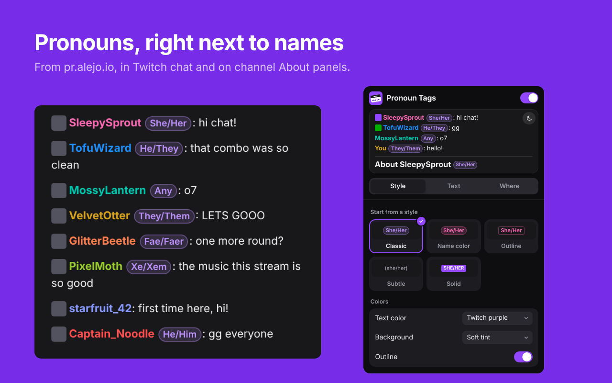

# Pronoun Tags for Twitch

Shows each chatter's pronouns from [pr.alejo.io](https://pr.alejo.io) next to their name in Twitch chat, and next to the streamer's name on the channel's About panel, in a style you choose.

## Install

| Browser | Get it from |
|---|---|
| Firefox | [Firefox Add-ons](FIREFOX_ADDONS_LINK) |
| Chrome, Brave, Opera, Vivaldi, Arc | [Chrome Web Store](https://chromewebstore.google.com/detail/jmfdbkcneimobndcodfjilfdlnclclag) |

Needs Firefox 140+ or a Chromium browser 121+. Works with Twitch's own chat and with FrankerFaceZ; 7TV's own chat is supported on a best-effort basis. Popout chat, mod view, the creator dashboard and VOD replays get tags too.

People who haven't set any pronouns get no tag. Clicking a tag opens pr.alejo.io, where anyone can set or change their own.

## Making it look your way

Click the Pronoun Tags button in the browser's toolbar. Every change shows up in open Twitch tabs straight away, and a preview at the top shows sample chat in Twitch's dark or light theme. **Open in a tab** gives the same settings in a full page.

- **Styles:** five ready-made looks to start from: Classic, Name color, Outline, Subtle and Solid.
- **Text:** capitals (She/Her, she/her, SHE/HER, She/her), brackets (none, round, square or curly), what goes between the words (/, ` / `, ·, a comma), and both words or only the first (She/Her or She).
- **Colors:** text in Twitch purple, the person's own name color, gray or any color you pick. A soft tint behind it, no background, or any color you pick. Outline on or off.
- **Shape and size:** round, slightly rounded or square corners. Size from 60% to 130% of the chat text, bold and italic.
- **Where:** in chat, on the About panel, and on your own messages, each on or off. Tags can go before or after the name. Clicking a tag can open pr.alejo.io, or do nothing.
- **Show pronouns** at the top turns every tag off and on.

Color settings have a picker and a box for a hex code. Some browsers close the toolbar popup when the color picker opens, so if that happens, type the code instead or use **Open in a tab**.

Settings are kept in the browser's extension storage on this computer.

The settings and tag tooltips are in English, Español, Français, Deutsch, Português, Русский and 日本語, following the browser's language.

## Good to know

### If you use FrankerFaceZ

FFZ has its own **Pronouns** add-on that shows pronouns as a badge. Turn it off (FFZ settings → Add-Ons → Pronouns), or you'll see pronouns twice.

### If you also use Rainbark

Rainbark has pronoun tags of its own. While this extension's tags are on the page, Rainbark leaves pronouns to it.

## Privacy

Pronoun Tags has no servers, no analytics and no ads. To look up pronouns, it sends the usernames of people in chat (and the channel you're viewing, for its About panel) to the pronouns API at `api.pronouns.alejo.io`. Settings stay in your browser. The details are in [PRIVACY.md](PRIVACY.md).

Pronoun Tags isn't made by or affiliated with Twitch or pr.alejo.io.

## How it works

| File | Job |
|---|---|
| `manifest.json` | Declares the extension for both browsers. It asks for the `storage` permission and access to `api.pronouns.alejo.io`, and runs on `www.twitch.tv` and `dashboard.twitch.tv`. |
| `background.js` | Makes every request to the pronouns API, keeps the shared cache and limits a busy chat to 6 requests at a time. Opens the settings once after installing. Runs as a service worker in Chromium and as an event page in Firefox. |
| `look.js` | The settings: their defaults, the choices, the five styles, and how a tag's text is written. Shared by the tags on Twitch and the settings page, so the preview always matches. |
| `content.js` | Watches Twitch for chat names and the About heading, asks the background for each person's pronouns and puts the tags in. Follows setting changes as they're made. |
| `content.css` | How tags look. The settings arrive as `data-pn-*` attributes and a few `--pn-*` variables on the page's `<html>` element, so one stylesheet covers every combination. Sizes are in `em`, so tags follow your chat font size. |
| `popup.html`, `options.html`, `settings.js`, `settings.css` | The settings, in the toolbar popup and in a tab. |
| `_locales/` | The text of the settings and the tag tooltips in each language. |

**Finding usernames.** The script reads the login from Twitch's `data-a-user` attribute, FFZ's `data-user`, the "(login)" part of a localized name, or the display name itself, in that order.

**Your own messages.** To leave your own messages untagged, the script reads your login from Twitch's `login` cookie (or, if that's missing, the login inside Twitch's `twilight-user` cookie). It takes nothing else from your cookies, and doesn't store or send what it reads.

**Pronoun words.** The background sends each person's pronouns as words, and the tab writes them out with your settings:

- Main and alternate pronouns give both subjects, for example She/They.
- Sets marked `singular` give just the subject, for example Any.
- Everything else gives subject and object, for example She/Her.

**Caching.** Results are never older than one hour:

- Each person is looked up once, then cached in the background and in each tab. Changing settings never looks anyone up again.
- The cache ends an hour after the API produced the data. If the CDN says its copy is already 20 minutes old, it's kept for 40 more.
- Requests skip the browser's own HTTP cache, which would otherwise add up to another hour.
- When a cached entry expires and that person chats again, they're looked up again and every tag of theirs on the page updates.
- "Not found" results are cached the same way. Failed requests are retried after a minute, and a 429 response pauses all requests for as long as the API asks.

## Changing things

- **Defaults, choices and styles:** `DEFAULTS`, `CHOICES` and `PRESETS` in `look.js`. A new choice or style also needs its name in each `_locales/<language>/messages.json`.
- **How a choice looks:** the matching `[data-pn-…]` rule in `content.css`.
- **Text and languages:** `_locales/<language>/messages.json`.
- **Where tags link:** `SETTINGS_URL` in `content.js` and `settings.js`.
- **Cache length:** `MAX_AGE_MS` in `background.js`.
